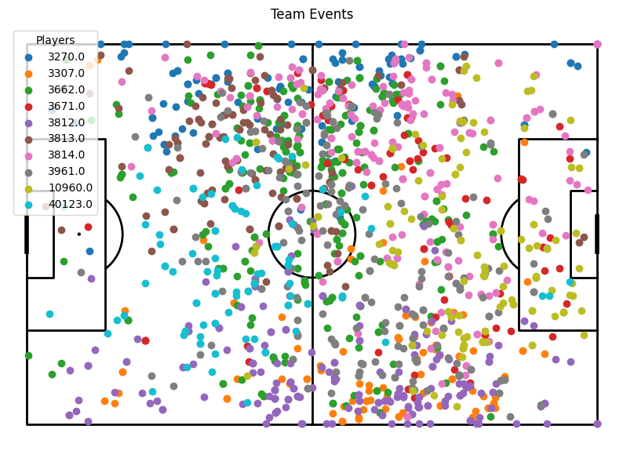
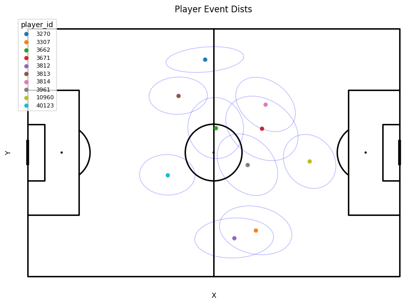
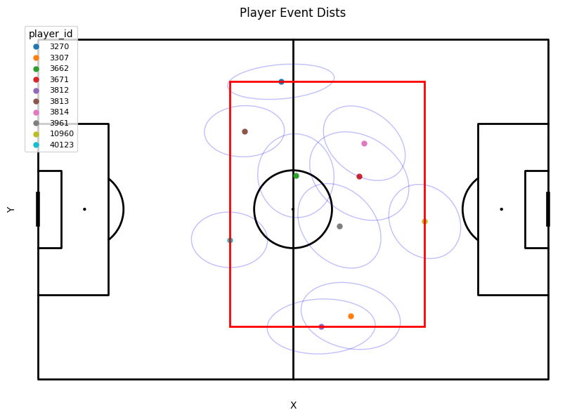
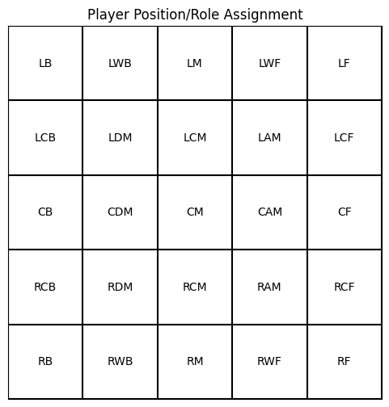
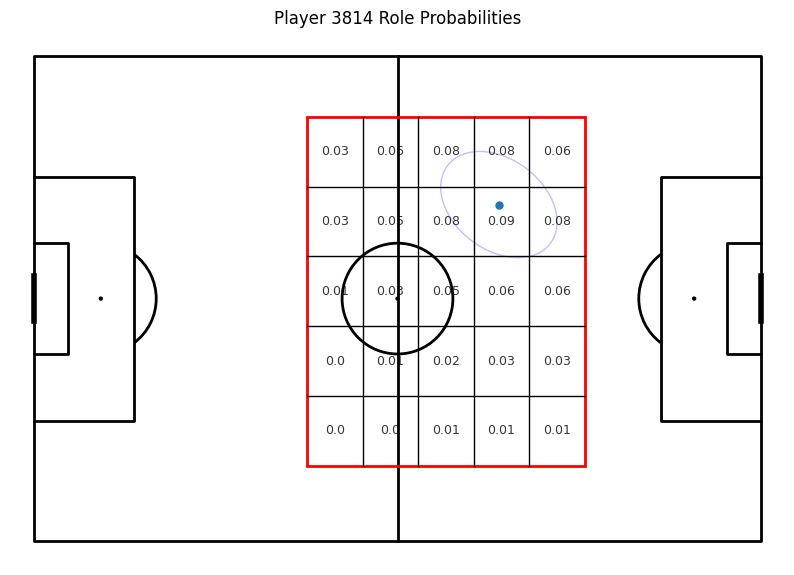
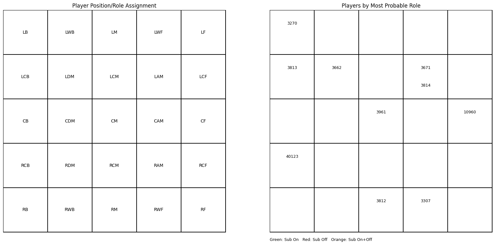
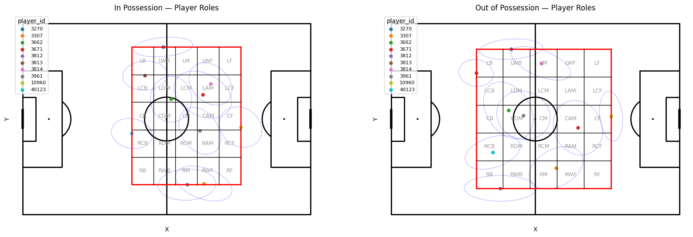
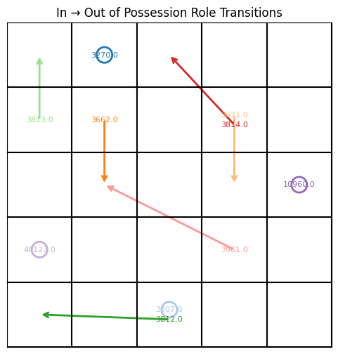

# ⚽ Position/Role Identification Algorithm

This repository contains an algorithm for identifying soccer player roles and positional tendencies using event data. The method models each player's spatial behavior with Gaussian distributions, discretizes team shape into zones, and assigns the most probable role per player. It also supports comparing **in-possession** vs **out-of-possession** roles and visualizing role transitions.

This approach was based off Hadi Sotudeh's approach to position identification using player tracking data: [hadisotudeh/analytics_cup_research](https://github.com/hadisotudeh/analytics_cup_research)

---

## 📌 Features

- Compute per-player spatial distributions using 2D Gaussians  
- Automatically derive team bounding box and subdivide into zones  
- Map zones to human-readable roles (e.g., LB, CM, RW)  
- Assign most probable role per player  
- Compare in-possession vs out-of-possession roles
- Substitution based algorithm  
- Visualize:
  - Event locations on pitch  
  - Gaussian ellipses  
  - Team bounding boxes and role grids  
  - Player role labels  
  - Role-change arrows between phases  

---

## 🧠 Core Idea

From our event data we want to assign player roles.

1. For each player, fit a 2D Gaussian over their event locations

  

2. Compute the team bounding box from player means

3. Subdivide the box into an `5 × 5` grid  
4. Assign each grid cell a role label  

5. Estimate probability of a player occupying each zone  

6. Select the most probable zone as the player’s role  

---

## 🔁 Phase Based Roles

Player's take on different roles when they are in possession vs. out of possession and we should assign them different roles for each phase! I was able to do this by filtering the type of events the gaussians are made from.

For in possession I focus on offensive events (passes, dribbles, shots, etc.) this allows us to see how the role a player takes within the team on the offensive side.

For out of possession I focus on defensive events (duels, tackles, blocks, dribbles against, etc.) and this allows us to see the defensive role a player takes within a team. 

These two roles can be similiar and most of the time they are quite close. However, this distinction allows us to identify players that take on drastically different roles in the different phases. We can identify full backs that become wingers on offense and CAM that become CDM on defense. 

---

## 🧩 Substitution Support

In this repo I also break down how this algorithm works seamlessly with substiutions which can pose a real challenge as the roles within a team can change. We approach this problem by breaking down the game into segments between a team's substitutions. We can then run through our algorithm for each segment to compute player role probability maps per segment. Then for each player we can aggregate their role probability maps into one by using the weighted average across the segments. This generates one role probability map per player that we can then assign their role off of.